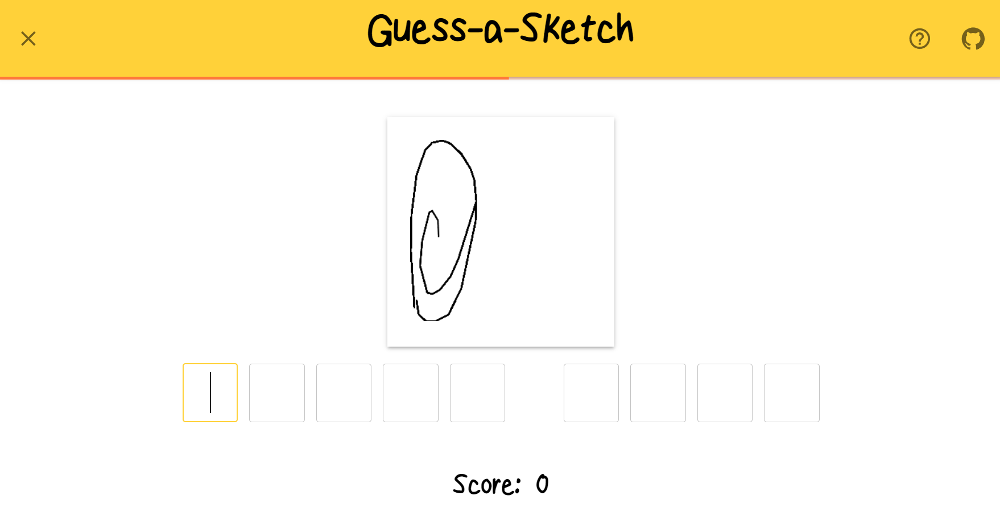

# Guess-A-Sketch
Guess-A-Sketch is a web game that utilizes [Google's Quick, Draw! dataset](https://github.com/googlecreativelab/quickdraw-dataset) to draw user-submitted pictures.



The goal of the game is to get the highest score possible by guessing the drawings shown on screen. 

### How Can I Play?
Play it for yourself [here](https://guess-a-sketch-6hes.onrender.com/)!

# How is was made
This application was created using `React`, `TypeScript`, and `Vite`

As a challenge for this project, I elected to use `Rust` as the language of the server.
You can check out the server implementation for this web app [here](https://github.com/zachcombs/rusty-guess-a-sketch).


# Run this app yourself
1. Clone this repository as well as the [server](https://github.com/zachcombs/rusty-guess-a-sketch).
2. Inside of `sketch`, run:

npm
```javascript
npm install
```

yarn
```javascript
npm install
```

pnpm
```javascript
pnpm install
```

3. Then start a development server:

npm
```javascript
npm dev
```

yarn
```javascript
npm dev
```

pnpm
```javascript
pnpm dev
```

4. Follow the startup instructions for the server
